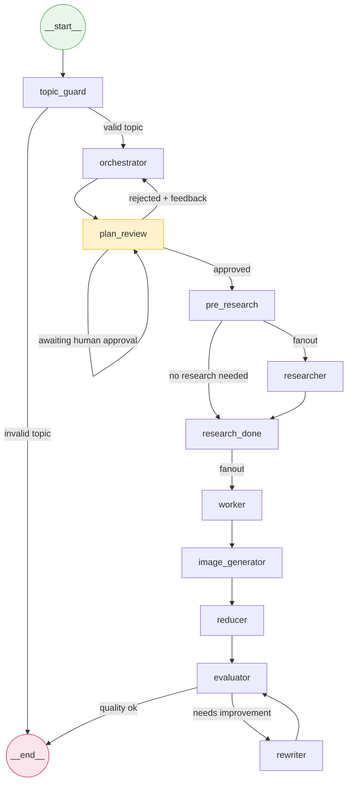

# Inkwell

An AI-powered blog generation agent built with LangGraph. Takes a software engineering topic and generates a well-researched technical blog post with diagrams, citations, and real sources.

## What It Does

```
Topic: "Event Driven Architecture in Microservices"
        |
        v
  [Plan] --> [Research] --> [Write] --> [Images] --> [Publish]
```

- Generates a structured blog plan (5-7 sections)
- Researches sections via web search (Tavily) for real, current sources
- Writes each section in parallel with inline citations
- Generates Excalidraw diagrams for sections that need them
- Human-in-the-loop plan review (approve or reject with feedback)
- Tracks token usage across all nodes

## Architecture



## Tech Stack

| Component | Technology |
|-----------|-----------|
| Orchestration | LangGraph (StateGraph, Send, interrupt, Command) |
| LLM | OpenAI-compatible API via LangChain |
| Diagrams | Excalidraw via MCP |
| Web Search | Tavily |
| Data Models | Pydantic |
| Checkpointing | InMemorySaver |

## Project Structure

```
blog-agent/
├── .env                         # API keys (never committed)
├── pyproject.toml               # Dependencies
├── src/
│   ├── config.py                # Environment config
│   ├── llm.py                   # LLM class (invoke, structured output, tool binding, token tracking)
│   ├── models.py                # Pydantic models + State
│   ├── graph.py                 # Graph assembly
│   ├── runner.py                # CLI entry point (async)
│   ├── nodes/
│   │   ├── orchestrator.py      # Plan creation
│   │   ├── fanout.py            # Fan-out routing functions
│   │   ├── researcher.py        # Web research with tool calling
│   │   ├── worker.py            # Section writing
│   │   ├── reducer.py           # Section combiner + image embedding
│   │   ├── reviewer.py          # Human-in-the-loop plan review
│   │   └── image_generator.py   # Excalidraw diagram generation
│   └── tools/
│       ├── search.py            # Tavily search tool
│       └── image.py             # Excalidraw MCP client
├── output/                      # Generated blog posts + images
└── notebooks/
    └── basic_agent.ipynb        # Original prototype
```

## Prerequisites

### Excalidraw MCP Server

Image generation requires the Excalidraw MCP server. Clone the repo and install dependencies:

```bash
git clone https://github.com/yctimlin/mcp_excalidraw.git
cd mcp_excalidraw
npm install
npm run build
```

The MCP server also needs an Express server running for canvas rendering. You can either run it from the cloned repo directly, or use Docker:

```bash
docker run -d -p 3000:3000 ghcr.io/yctimlin/mcp_excalidraw-canvas:latest
```

Set these in your `.env`:

```
EXCALIDRAW_PATH=/path/to/mcp_excalidraw/build/index.js
EXCALIDRAW_SERVER_URL=http://localhost:3000
```

## Setup

```bash
# Create and activate virtual environment
python -m venv venv
source venv/bin/activate

# Install dependencies
pip install -e .

# Configure API keys
cp .env.example .env
# Edit .env with your keys:
#   BASE_URL, API_KEY, MODEL_NAME (OpenAI-compatible endpoint)
#   TAVILY_API_KEY (from tavily.com)
#   EXCALIDRAW_PATH, EXCALIDRAW_SERVER_URL (see Prerequisites)
```

## Usage

### Streamlit UI (Recommended)

```bash
streamlit run ui/app.py
```

Opens at `http://localhost:8501` by default.

To run on a custom port:

```bash
streamlit run ui/app.py --server.port 8502
```

To make the port permanent, create `.streamlit/config.toml`:

```toml
[server]
port = 8502
```

### CLI

```bash
python -m src.runner "Event Driven Architecture in Microservices"
```